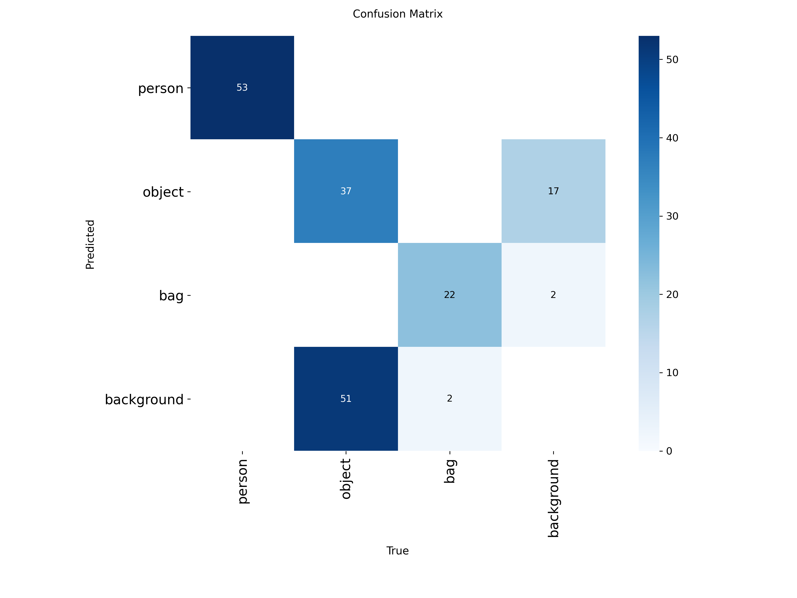

# **Computer Vision & Machine Learning Project: Automated Shoplifting Anomaly Detection**

## **Table of Contents**
*   [Problem Statement](#problem-statement)
*   [Overall Project Goal](#overall-project-goal)
*   [Key Technologies and Libraries Used](#key-technologies-and-libraries-used)
*   [Project Pipeline](#project-pipeline)
    *   [Phase 1: Data Acquisition & Annotation Management](#phase-1-data-acquisition--annotation-management)
    *   [Phase 2: Feature Engineering for Behavioral Analysis](#phase-2-feature-engineering-for-behavioral-analysis)
    *   [Phase 3: Machine Learning Model Training](#phase-3-machine-learning-model-training)
    *   [Phase 4: Automated Object Detection (YOLO Fine-tuning)](#phase-4-automated-object-detection-yolo-fine-tuning)
    *   [Phase 5: End-to-End Desktop Application Development](#phase-5-end-to-end-desktop-application-development)
*   [Model Performance Metrics & Results Logging](#model-performance-metrics--results-logging)
    *   [Random Forest Classifier Performance](#random-forest-classifier-performance)
    *   [YOLOv8 Object Detection Model Performance](#yolov8-object-detection-model-performance)
*   [Project Outcomes & Deliverables](#project-outcomes--deliverables)
*   [Getting Started](#getting-started)
    *   [Prerequisites](#prerequisites)
    *   [Installation](#installation)
    *   [Running the Pipeline](#running-the-pipeline)
*   [Project Structure](#project-structure)
*   [Contributing](#contributing)
*   [Contact](#contact)

---

## **Problem Statement**
The project addresses the critical need for automated surveillance solutions in retail environments. Traditional surveillance relies on constant human monitoring of video feeds, are inefficient, costly, and prone to human error, leading to missed shoplifting incidents. This system provides an intelligent, automated approach to identify and flag suspicious behaviors, significantly enhancing security operations.

## **Overall Project Goal**
To design, develop, and implement a complete, end-to-end machine learning pipeline for shoplifting anomaly detection in surveillance video. This project culminates in a user-friendly desktop application, showcasing practical skills in computer vision, machine learning experimentation, and software development for real-world AI solutions.

## **Key Technologies and Libraries Used**
This project leverages a robust set of tools and libraries, demonstrating proficiency in core computer vision and machine learning development:

*   **Python:** The primary programming language, used for all scripting, data processing, model training, and application development.
*   **OpenCV (`cv2`):** Utilized extensively for image and video processing tasks, including frame extraction, manipulation, and drawing annotations (bounding boxes, labels) on video frames.
*   **NumPy:** Fundamental for efficient numerical operations and array manipulation, especially in feature calculation and image processing.
*   **Ultralytics (`YOLO`):** Employed for state-of-the-art object detection using the YOLOv8 architecture.
*   **Scikit-learn (`sklearn`):** Used for classical machine learning model training (Random Forest Classifier) and data splitting.
*   **Pandas:** Essential for efficient data manipulation, cleaning, and structuring the feature engineering dataset.
*   **Joblib:** Used for efficient serialization and deserialization of trained machine learning models.
*   **CustomTkinter (`ctk`):** Chosen for building a modern, cross-platform desktop Graphical User Interface (GUI).
*   **Pillow (`PIL`):** Used for image format conversions and manipulation within the GUI.
*   **Threading:** Implemented to ensure the GUI remains responsive during computationally intensive video analysis.
*   **CVAT (Computer Vision Annotation Tool):** An external, industry-standard tool used for meticulous manual video annotation.
*   **FFmpeg:** Utilized for efficient video frame extraction during initial data preparation.
*   **Git:** Employed for version control, demonstrating best practices in collaborative development and project management.

## **Project Pipeline**
This project showcases the development of a complete image and video processing pipeline, from raw data to a deployable application.

<div align="center">

</div>

### **Phase 1: Data Acquisition & Annotation Management**
*   **Process:** Surveillance video clips (categorized as "normal" and "shoplifting") were acquired. Frames were extracted to facilitate detailed annotation.
*   **Annotation:** Utilized **CVAT** for meticulous manual annotation, drawing bounding boxes for `person`, `object` (products), and `bag`. Crucially, the `occluded` flag was used to mark objects hidden in bags, providing vital ground truth for shoplifting events.
*   **Output:** Exported task-level `.zip` files containing `annotations.xml`.

### **Phase 2: Feature Engineering for Behavioral Analysis**
*   **Script:** `feature_extractor.py`.
*   **Process:** Developed a pipeline to transform raw visual annotations into numerical features. This involved parsing `annotations.xml` files and calculating behavioral metrics for each frame.
*   **Key Features:** `num_people`, `num_products`, `num_bags`, `min_person_product_dist`, and the critical `product_in_bag_occluded` flag.
*   **Output:** `features.csv`, a structured dataset ready for ML model training.

### **Phase 3: Machine Learning Model Training**
*   **Model:** A **Random Forest Classifier** (from `scikit-learn`) was chosen for its interpretability and performance in classification tasks.
*   **Script:** `train_model.py`.
*   **Process:** The model was trained on `features.csv`, split into training and testing sets, and rigorously evaluated. Performance metrics were logged and visualized.
*   **Output:** The trained model (`shoplifting_model.joblib`) and a visual confusion matrix for benchmarking.

### **Phase 4: Automated Object Detection (YOLO Fine-tuning)**
*   **Challenge:** Manual annotation for live analysis is impractical.
*   **Solution:** Integrate an automated object detection model (YOLO) to replace the manual annotation step.
*   **Data Prep Script:** `prepare_yolo_data.py` converted CVAT annotations to YOLO's specific format (`.txt` labels).
*   **Training Script:** `train_yolo.py` fine-tuned a pre-trained YOLOv8n model on custom classes (`person`, `object`, `bag`).
*   **Output:** A custom-trained YOLO model (`best.pt`), highly specialized for the project's domain.

### **Phase 5: End-to-End Desktop Application Development**
*   **Framework:** **CustomTkinter** was used to build a modern, responsive GUI.
*   **Main Script:** `desktop_app.py`.
*   **Functionality:** The application integrates the custom YOLO model and the Random Forest classifier to provide real-time video analysis. It features live visual feedback, a progress indicator, and a "Cancel Analysis" option (implemented with **Threading** for responsiveness). A critical bug in `product_in_bag_occluded` logic was identified and fixed, demonstrating debugging and problem-solving skills.

## **Model Performance Metrics & Results Logging**
This section details the performance of both the YOLO object detection model and the Random Forest behavioral classification model, showcasing the results logging and benchmarking capabilities.

### **Random Forest Classifier Performance**
The Random Forest model was trained to classify frames as "normal" or "shoplifting" based on engineered features. It achieved high accuracy and recall on the test set, demonstrating its capability in identifying suspicious behavior patterns.

**Overall Accuracy:** 0.9730

**Confusion Matrix:**
| Actual/Predicted | Predicted Normal | Predicted Shoplifting |
| :--------------- | :--------------- | :-------------------- |
| **Actual Normal**    | 51               | 2                     |
| **Actual Shoplifting** | 0                | 21                    |

**Classification Report:**
| Class       | Precision | Recall | F1-Score | Support |
| :---------- | :-------- | :----- | :------- | :------ |
| **Normal**      | 1.00      | 0.96   | 0.98     | 53      |
| **Shoplifting** | 0.91      | 1.00   | 0.95     | 21      |
| **Accuracy**    |           |        | 0.97     | 74      |
| **Macro Avg**   | 0.96      | 0.98   | 0.97     | 74      |
| **Weighted Avg**| 0.98      | 0.97   | 0.97     | 74      |

*   **Visual Representation:**
    <div align="center">
    
    </div>

### **YOLOv8 Object Detection Model Performance**
The custom-trained YOLOv8 model's performance was rigorously evaluated during its fine-tuning process, demonstrating strong object detection capabilities for the defined classes.

*   **Training Results Plot:** This plot summarizes various metrics (e.g., Box Loss, Objectness Loss, Classification Loss, Precision, Recall, mAP) over the training epochs, illustrating the model's learning progress and convergence.
    <div align="center">
    
    </div>

*   **Confusion Matrix:** This matrix shows how well the YOLO model classified each object (`person`, `object`, `bag`), indicating true positives, false positives, and false negatives.
    <div align="center">
    
    </div>

*   **Precision-Recall (PR) Curves:** These curves illustrate the trade-off between precision and recall for the YOLO model, a key metric for object detection performance.
    <div align="center">
    
    </div>

## **Project Outcomes & Deliverables**
This project successfully delivers a robust and functional AI solution:

*   **End-to-End Pipeline:** A complete system from raw video data to actionable insights.
*   **Automated Anomaly Detection:** Capable of automatically flagging suspicious shoplifting behaviors.
*   **Custom Model Development:** Fine-tuned YOLO model for precise, domain-specific object detection.
*   **High-Performance ML:** Utilizes a highly accurate Random Forest model for behavioral classification.
*   **User-Friendly Application:** A responsive GUI with live visual feedback, progress indication, and user controls.
*   **Reproducible Research:** The project structure and scripts allow for easy reproduction of the pipeline.

## **Getting Started**

### **Prerequisites**
*   **Python 3.8+:** Ensure Python is installed and added to your PATH.
*   **Git:** For cloning the repository.
*   **FFmpeg:** (Optional, but recommended for initial frame extraction) Download and add to your system's PATH.
*   **CVAT:** (Optional, if you plan to extend the dataset or perform further annotations) Access via Docker or local installation.

### **Installation**
1.  **Clone the repository:** 
    ```bash
    git clone https://github.com/your-username/your-repo-name.git
    cd your-repo-name/Shoplifting\ Detection
    ```
    *(Replace `your-username` and `your-repo-name` with your actual GitHub details)*
2.  **Create a virtual environment (highly recommended):**
    ```bash
    python -m venv venv
    # On Windows
    .\venv\Scripts\activate
    # On macOS/Linux
    source venv/bin/activate
    ```
3.  **Install dependencies:**
    *(Note: You will need to generate a `requirements.txt` file by running `pip freeze > requirements.txt` after installing all libraries used in the project.)*  
    ```bash
    pip install -r requirements.txt
    ```
    *(Alternatively, manually install: `pip install opencv-python ultralytics scikit-learn pandas joblib customtkinter Pillow numpy seaborn matplotlib`)*

## **Running the Pipeline**
This section guides you through running each step of the project's pipeline, from data preparation to launching the final application. Ensure you are in the `Shoplifting Detection/` directory for these commands.

### **Step 1: Data Acquisition & Frame Extraction**
*   **Purpose:** Prepare your raw video data for annotation.
*   **Action:** Place your raw video files (e.g., `normal-1.mp4`, `shoplifting-1.mp4`) into the `dataset/normal/` and `dataset/shoplifting/` folders respectively.
*   **Run:** Use `extract_frames.py` to extract frames from your videos into `dataset/frames/`.
    ```bash
    python extract_frames.py
    ```
    *(Note: This script needs to be configured to point to your specific video files.)*

### **Step 2: Manual Annotation (using CVAT)**
*   **Purpose:** Create ground truth annotations for your frames.
*   **Action:** Upload your extracted frames to CVAT, perform annotations for `person`, `object`, and `bag` classes, marking `occluded` objects in bags.
*   **Output:** Export annotations as individual task-level `.zip` files into the `annotations/` folder.

### **Step 3: Feature Engineering**
*   **Purpose:** Convert raw annotations into structured features for the behavioral model.
*   **Run:** 
    ```bash
    python feature_extractor.py
    ```
*   **Output:** `features.csv` in the `Shoplifting Detection/` directory.

### **Step 4: Train Machine Learning Model**
*   **Purpose:** Train the Random Forest classifier for behavioral analysis.
*   **Run:** 
    ```bash
    python train_model.py
    ```
*   **Output:** `shoplifting_model.joblib` and `rf_confusion_matrix.png` in the `Shoplifting Detection/` directory.

### **Step 5: Prepare Data for YOLO Training**
*   **Purpose:** Convert CVAT annotations to YOLO format and create train/validation splits.
*   **Run:** 
    ```bash
    python prepare_yolo_data.py
    ```
*   **Output:** `yolo_dataset/` folder with images and labels, and `data.yaml` in the `Shoplifting Detection/` directory.

### **Step 6: Train YOLO Object Detection Model**
*   **Purpose:** Fine-tune the YOLOv8 model on your custom dataset.
*   **Run:** 
    ```bash
    python train_yolo.py
    ```
*   **Output:** Trained YOLO model (`best.pt`) and performance plots in `runs/detect/yolo_shoplifting_custom/`.

### **Step 7: Launch the Desktop Application**
*   **Purpose:** Run the end-to-end application for real-time shoplifting detection.
*   **Run:** 
    ```bash
    python desktop_app.py
    ```
    The GUI will launch, allowing you to select a video for analysis.

## **Project Structure**
```
Shoplifting Detection/
├── annotations/                # Original CVAT annotation zip files (for reproducibility)
├── dataset/                    # Source videos and extracted frames (for reproducibility)
│   ├── frames/
│   ├── normal/
│   └── shoplifting/
├── assets/                     # Images for README (performance plots)
├── cvat/                       # (Optional) CVAT software - typically ignored by Git
├── data.yaml                   # YOLO dataset configuration
├── desktop_app.py              # Main GUI application
├── extract_frames.py           # Script to extract frames from videos
├── feature_extractor.py        # Script to extract features from annotations
├── prepare_yolo_data.py        # Script to convert CVAT annotations to YOLO format
├── train_model.py              # Script to train the Random Forest model
├── train_yolo.py               # Script to fine-tune the YOLO model
├── .gitignore                  # Specifies files/folders to ignore in Git
└── README.md                   # This file
```
*(The following items are generated during the pipeline and are ignored by Git to keep the repository lean. They will be created when you run the relevant scripts.)*  
```
├── runs/                       # YOLO training runs and saved models (e.g., best.pt)
│   └── detect/
│       └── yolo_shoplifting_custom/
│           └── weights/
│               └── best.pt
├── yolo_dataset/               # Prepared dataset for YOLO training (images and labels)
│   ├── images/
│   └── labels/
├── shoplifting_model.joblib    # Trained Random Forest model
├── features.csv                # Engineered features dataset
```

## **Contributing**
Contributions are welcome! If you have suggestions for improvements or new features, please open an issue or submit a pull request.

## **Contact**
*   GitHub: https://github.com/talha-shafique
*   Email: talha.shafique126@gmail.com
